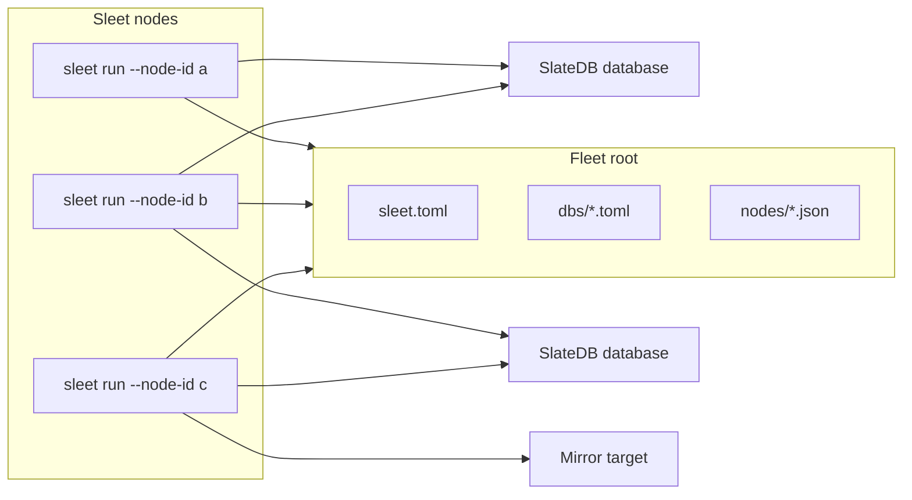

# Architecture

Sleet uses object storage as a coordination mechanism. It does not require a
central server or database. Nodes read the same tree of objects and compute
ownership of work locally. The tree contains a registry of databases, a
registry of live nodes, and a configuration file.

## Model



Every node reads the same tree:

```text
<root>/
  sleet.toml
  dbs/<percent-encoded-db-url>.toml
  nodes/<node-id>.<service-letters>.json
```

## Placement

Each node computes ownership locally from:

- the registered database URLs in `dbs/`
- the resolved service config for each database
- the live node set from `nodes/`
- the services each live node offers

Sleet uses rendezvous hashing to keep node assignments stable. Rendezvous
hashing is a deterministic, stateless algorithm that ranks nodes for each
database. Each node computes the same ranking and picks the highest-ranked
live node for each service. The result is a mapping of databases to nodes and
services. Adding or removing a node moves only the assignments affected by that
node's rank.

For `gc` and `compactor-coordinator`, the top-ranked live node owns the
`(database, service)` pair. For `compaction-workers`, the top `count` nodes
run compaction workers for the `(database, service)` pair. For mirroring,
ownership is per `(database, mirror, destination)` triple.

## Heartbeats and liveness

A node writes one heartbeat object every `heartbeat_interval`:

```text
nodes/sleet-1.cgmw.json
```

The suffix letters define the services the node offers:

| Letter | Service                 |
| ------ | ----------------------- |
| `c`    | `compactor-coordinator` |
| `g`    | `gc`                    |
| `m`    | `mirror`                |
| `w`    | `compaction-workers`    |

The placement calculation uses the object name and `LastModified` object store
metadata to determine the services offered and node liveness. The heartbeat body
contains the node's `node_id` and a list of the services it offers. The body is
not used for liveness or placement, but it is useful for debugging and
monitoring.

A node is live when its heartbeat is younger than `heartbeat_timeout`. A clean
shutdown deletes the heartbeat, so peers can take over without waiting for a
timeout.

## Services

Sleet runs four service types:

| Service                 | Work                                                                         |
| ----------------------- | ---------------------------------------------------------------------------- |
| `gc`                    | Runs SlateDB garbage collection for the database.                            |
| `compactor-coordinator` | Schedules compactions and commits completed results.                         |
| `compaction-workers`    | Claims and executes SlateDB compaction jobs.                                 |
| `mirror`                | Copies a database to configured mirror targets and commits target manifests. |

Sleet only decides which nodes service loops run. SlateDB is responsible for
protecting the database from concurrent access:

- `.manifest` CAS for commits
- compactor epoch fencing for coordinators
- `.compactions` CAS claims for workers

Duplicate service execution can waste work, but will never corrupt a database.

## Failure behavior

Sleet treats placement as an efficiency mechanism. During stale reads, clock
skew, node restarts, or network partitions, two nodes may briefly believe they
own the same assignment. That is acceptable because the underlying SlateDB
operations are fenced or idempotent.

A missing owner is also possible during convergence. In that case work is
delayed until the next config or heartbeat poll. The usual handoff bounds are:

| Change                               | Expected convergence                        |
| ------------------------------------ | ------------------------------------------- |
| Node dies without deleting heartbeat | about `heartbeat_timeout`                   |
| Node exits cleanly                   | next `heartbeat_interval`                   |
| Registry or config changes           | up to `config_poll` plus one heartbeat tick |

Nodes must be able to reach the stores for their offered services.

## Scaling

Coordination cost scales mostly with node count:

- each node PUTs one heartbeat per `heartbeat_interval`
- each node LISTs `nodes/` per `heartbeat_interval`
- each node LISTs `dbs/` every `config_poll`
- assignments are computed in memory

Database work scales with database count and configured poll intervals. At
very large registry sizes, `dbs/` LIST cardinality becomes the pressure
point; [RFC 0001](../rfcs/0001-design.md) tracks an inventory-backed registry
as future work.

## RFCs

See the [rfcs/](../rfcs/) directory for design documents.
