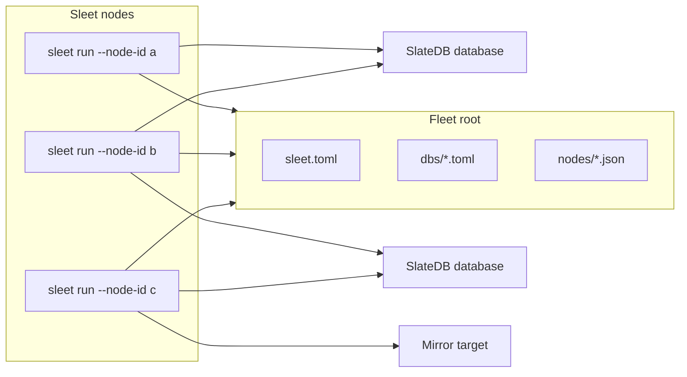

# Architecture

Sleet is an object-store coordinated control plane for SlateDB background services. It is not a proxy. Readers and writers still open SlateDB databases directly.

## Model



Every node reads the same tree:

```text
<root>/
  sleet.toml
  dbs/<percent-encoded-db-url>.toml
  nodes/<node-id>.<service-letters>.json
```

The tree contains intent and liveness. It does not contain assignments.

## Placement

Each node computes ownership locally from:

- the registered database URLs in `dbs/`
- the resolved service config for each database
- the live node set from `nodes/`
- the services each live node offers

Sleet uses rendezvous hashing. For `gc` and `compactor-coordinator`, the top-ranked live node owns the `(database, service)` pair. For `compaction-workers`, the top `count` nodes poll the database's compaction queue. For mirroring, ownership is per `(database, mirror, target)` triple.

Adding or removing a node moves only the assignments affected by that node's rank. No node writes the result back to storage.

## Heartbeats and liveness

A node writes one heartbeat object every `heartbeat_interval`:

```text
nodes/sleet-1.cgmw.json
```

The suffix letters name offered services:

| Letter | Service |
| --- | --- |
| `c` | `compactor-coordinator` |
| `g` | `gc` |
| `m` | `mirror` |
| `w` | `compaction-workers` |

Placement reads the object name and `LastModified`. The heartbeat body is for status output: node version, SlateDB version, and aggregate task state.

A node is live when its heartbeat is younger than `heartbeat_timeout`. A clean shutdown deletes the heartbeat, so peers can take over without waiting for timeout.

## Services

Sleet runs four service types:

| Service | Work |
| --- | --- |
| `gc` | Runs SlateDB garbage collection for the database. |
| `compactor-coordinator` | Schedules compactions and commits completed results. |
| `compaction-workers` | Claims and executes SlateDB compaction jobs. |
| `mirror` | Copies a database to configured mirror targets and commits target manifests. |

Sleet only decides where service loops run. SlateDB provides the safety primitives:

- manifest CAS for commits
- compactor epoch fencing for coordinators
- `.compactions` CAS claims for workers
- checkpoint-aware garbage collection

Duplicate service execution can waste work. It should not corrupt a database.

## Failure behavior

Sleet treats placement as an efficiency mechanism. During stale reads, clock skew, node restarts, or network partitions, two nodes may briefly believe they own the same assignment. That is acceptable because the underlying SlateDB operations are fenced or idempotent.

A missing owner is also possible during convergence. In that case work is delayed until the next config or heartbeat poll. The usual handoff bounds are:

| Change | Expected convergence |
| --- | --- |
| Node dies without deleting heartbeat | about `heartbeat_timeout` |
| Node exits cleanly | next heartbeat list |
| Registry or config changes | up to `config_poll` plus one heartbeat tick |

Nodes must be able to reach the stores for their offered services. Placement does not test reachability.

## Scaling shape

Coordination cost scales mostly with node count:

- each node PUTs one heartbeat per tick
- each node LISTs `nodes/` per tick
- each node LISTs `dbs/` every `config_poll`
- assignments are computed in memory

Database work scales with database count and configured poll intervals. Worker polling backs off while a database is idle. At very large registry sizes, `dbs/` LIST cardinality becomes the pressure point; [DESIGN.md](../DESIGN.md) tracks inventory-based discovery as future work.

## Deeper reference

- [DESIGN.md](../DESIGN.md) describes coordination, failure handling, scaling, and crate layout.
- [DESIGN-MIRROR.md](../DESIGN-MIRROR.md) describes mirror invariants and restore semantics.
- [src/placement.rs](../src/placement.rs) contains the frozen rendezvous hash.
- [src/heartbeat.rs](../src/heartbeat.rs) defines heartbeat naming and JSON schema generation.
